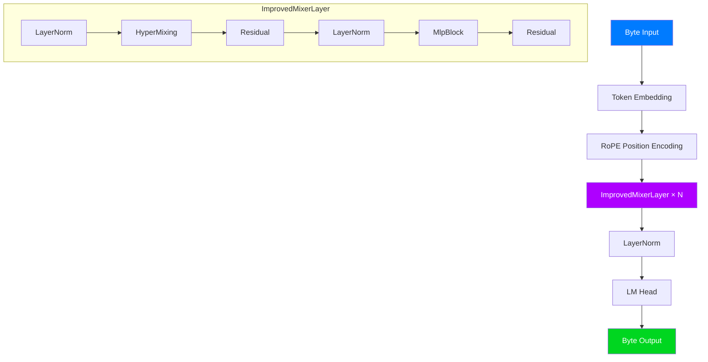

<div align="center">


<br/>

# MicroMixer-1

**Attention-Free Language Model based on MLP-Mixer**


<br/>
<br/>

<strong style="font-size: 1.3em;">No Attention. No Transformers. Pure MLP.</strong>

<br/>
<br/>

[](https://github.com/llaa33219/MicroMixer-1)
[](https://github.com/llaa33219/MicroMixer-1)

</div>

---

## 📋 Overview

MicroMixer-1 is a research project exploring **MLP-Mixer architectures for causal language modeling**. Instead of using Transformer attention mechanisms, this project uses only MLP layers with token mixing and channel mixing to generate text.

### Key Features

- 🚫 **No Attention**: Completely removes self-attention mechanisms
- 🧱 **MLP-Only**: Uses MLP-Mixer with token/channel mixing
- 📝 **Byte-Level**: 256 vocabulary byte tokenizer (multilingual capable)
- 🔄 **RoPE**: Rotary Position Embedding for length generalization
- ⚡ **HyperMixing**: O(S) complexity token mixing via hypernetworks

---

## 🏗️ Architecture

<div align="center">



</div>

### Model Variants

| Model | Parameters | Hidden Dim | Seq Len | Layers | Checkpoint |
|-------|------------|------------|---------|--------|------------|
| **100K** | 136,908 | 84 | 64 | 3 | [v2_hyper_100k](checkpoints/v2_hyper_100k/) |
| **300K** | 331,680 | 128 | 128 | 3 | [v2_hyper_300k](checkpoints/v2_hyper_300k/) |
| **500K** | 557,328 | 176 | 128 | 3 | [v2_hyper_500k](checkpoints/v2_hyper_500k/) |
| **1M** | 967,584 | 224 | 256 | 3 | [v2_hyper_1M](checkpoints/v2_hyper_1M/) |

---

## 🚀 Quick Start

### Installation

```bash
git clone https://github.com/llaa33219/MicroMixer-1.git
cd MicroMixer-1
pip install -e .
```

### Generate Text

```python
import torch
from src.model import MicroMixerV2, MicroMixerV2Config
from src.tokenizer import ByteTokenizer

# Load model
config = MicroMixerV2Config(
    max_seq_len=256,
    hidden_dim=224,
    channel_mlp_dim=576,
    num_layers=3,
    use_hyper=True,
)

model = MicroMixerV2(config)
checkpoint = torch.load("checkpoints/v2_hyper_1M/epoch_4.pt", weights_only=False)
model.load_state_dict(checkpoint["model_state_dict"])
model.eval()

# Generate
tokenizer = ByteTokenizer()
input_ids = torch.tensor([tokenizer.encode("Once upon a time")])

with torch.no_grad():
    output = model.generate(input_ids, max_new_tokens=64, temperature=0.8, top_k=40)

print(tokenizer.decode(output[0].tolist()))
```

### Train Your Own

```bash
# Train 100K model for 10 epochs
python train.py --model 100k --version v2 --epochs 10 --batch-size 32

# Train 1M model with custom settings
python train.py --model 1M --version v2 --epochs 5 --lr 1e-4 --max-samples 10000
```

---

## 📊 Training Data

The models are trained on:

- **[TinyStories](https://huggingface.co/datasets/roneneldan/TinyStories)**: Simple children's stories
- **[DailyDialog](https://huggingface.co/datasets/daily_dialog)**: Conversational data

---

## ⚠️ Limitations

<div style="background-color: #FF050515; padding: 15px; border-radius: 8px; border-left: 4px solid #FF0505;">

- **Small Model Size**: Largest model is only ~1M parameters
- **Grammar Issues**: Generated text often has grammatical errors
- **Repetitive Patterns**: Tends to repeat learned phrases from training data
- **Short Context**: Limited context window (64-256 tokens)

</div>

---

## 🔬 Research Motivation

This project explores whether **MLP-only architectures** can perform competitive language modeling without attention mechanisms. Key questions:

1. Can MLP-Mixer match Transformer quality at small scales?
2. How does HyperMixing compare to standard token mixing?
3. What are the fundamental limits of attention-free language models?

---

## 📁 Project Structure

```
MicroMixer-1/
├── src/
│   ├── model.py          # MicroMixerV1, V2, HyperMixing
│   ├── config.py         # Model configurations
│   ├── data.py           # Dataset loading
│   ├── trainer.py        # Training loop
│   └── tokenizer.py      # Byte-level tokenizer
├── checkpoints/
│   ├── v2_hyper_100k/    # 100K model checkpoints
│   ├── v2_hyper_300k/    # 300K model checkpoints
│   ├── v2_hyper_500k/    # 500K model checkpoints
│   └── v2_hyper_1M/      # 1M model checkpoints
├── train.py              # Training script
├── generate_test.py      # Generation testing
├── pyproject.toml        # Project config
└── LICENSE               # Apache 2.0
```

---

## 🤝 Contributing

Contributions are welcome! Please feel free to submit a Pull Request.

---

## 📄 License

This project is licensed under the Apache License 2.0 - see the [LICENSE](LICENSE) file for details.

---

<div align="center">

**Built with ❤️ for research**

[](https://github.com/llaa33219/MicroMixer-1/issues)
[](https://github.com/llaa33219/MicroMixer-1/pulls)

</div>
