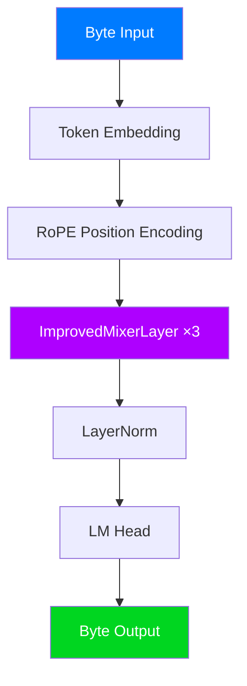

<div align="center">


# MicroMixer-1-300K-TinyStories


<br/>
<br/>

<table>
<tr>
<td align="center" style="padding: 20px;">
<strong style="color: #007BFF; font-size: 1.2em;">Micro Language Model</strong><br/>
<em>Attention-Free • MLP-Only • Byte-Level</em>
</td>
</tr>
</table>

[](https://github.com/llaa33219/MicroMixer-1)

</div>

---

<div style="background: linear-gradient(135deg, #007BFF22, #AE00FF22); padding: 20px; border-radius: 10px; border-left: 4px solid #007BFF;">

## 📋 Overview

**MicroMixer-1-300K** is a medium-sized model with 2.4x more parameters than the 100K variant. It can process 128 token sequences and begins to learn basic word patterns.

</div>

---

## 🏗️ Architecture

<div align="center">



</div>

### Model Configuration

<table>
<tr>
<th style="background-color: #007BFF; color: white;">Parameter</th>
<th style="background-color: #AE00FF; color: white;">Value</th>
</tr>
<tr><td>Total Parameters</td><td><code>331,680</code></td></tr>
<tr><td>Hidden Dimension</td><td><code>128</code></td></tr>
<tr><td>Channel MLP Dimension</td><td><code>288</code></td></tr>
<tr><td>Number of Layers</td><td><code>3</code></td></tr>
<tr><td>Max Sequence Length</td><td><code>128</code></td></tr>
<tr><td>Vocabulary Size</td><td><code>256</code> (Byte-level)</td></tr>
</table>

### Core Components

<div style="background-color: #1a1a2e; padding: 15px; border-radius: 8px;">

```
┌─────────────────────────────────────────────┐
│           ImprovedMixerLayer                 │
│  ┌─────────────────────────────────────┐    │
│  │  LayerNorm → HyperMixing → Residual │    │ ← Token Mixing
│  ├─────────────────────────────────────┤    │
│  │  LayerNorm → MlpBlock → Residual    │    │ ← Channel Mixing
│  └─────────────────────────────────────┘    │
└─────────────────────────────────────────────┘
```

</div>

#### 1️⃣ RoPE (Rotary Position Embedding)
- Encodes positions via **rotation transformations**
- Enables length extrapolation beyond training sequences

#### 2️⃣ HyperMixing (Token Mixing)
- Compresses past context via **cumulative average pooling**
- Hypernetwork generates adaptive weights
- O(S) complexity token mixing without attention

#### 3️⃣ MlpBlock (Channel Mixing)
- Non-linear transformation of feature dimensions
- Structure: `Linear → GELU → Linear`

---

## 📈 Key Differences from 100K

<div style="background-color: #FFEA0015; padding: 15px; border-radius: 8px; border-left: 4px solid #FFEA00;">

| Metric | 100K | 300K | Change |
|--------|------|------|--------|
| Parameters | 136,908 | 331,680 | **2.4x** |
| Hidden Dim | 84 | 128 | 1.5x |
| Channel MLP | 128 | 288 | 2.3x |
| Sequence Length | 64 | 128 | **2x** |

</div>

---

## ⚠️ Limitations

<div style="background-color: #FF050515; padding: 15px; border-radius: 8px; border-left: 4px solid #FF0505;">

| Limitation | Description |
|------------|-------------|
| **Limited Context** | 128 tokens still insufficient for complex context |
| **Unstable Generation** | Word patterns appear but sentence completion is poor |
| **Vocabulary Gaps** | Rare characters handled poorly despite byte-level encoding |
| **Repetitive Output** | Repeats patterns like "little girl named Timmy" |

</div>

---

## 📊 Training Data

<div style="background-color: #00D62015; padding: 15px; border-radius: 8px; border-left: 4px solid #00D620;">

**Dataset**: [TinyStories](https://huggingface.co/datasets/roneneldan/TinyStories)

- Simple children's stories dataset
- Learns basic grammar and vocabulary
- Contains many patterns like "Once upon a time", "little girl/boy"

</div>

---

## 🔧 Usage

```python
import torch
from src.model import MicroMixerV2, MicroMixerV2Config
from src.tokenizer import ByteTokenizer

# Clone the repository first:
# git clone https://github.com/llaa33219/MicroMixer-1.git
# cd MicroMixer-1

config = MicroMixerV2Config(
    max_seq_len=128,
    hidden_dim=128,
    channel_mlp_dim=288,
    num_layers=3,
    use_hyper=True,
)

model = MicroMixerV2(config)
checkpoint = torch.load("checkpoints/v2_hyper_300k/epoch_4.pt", weights_only=False)
model.load_state_dict(checkpoint["model_state_dict"])
model.eval()

tokenizer = ByteTokenizer()
input_ids = torch.tensor([tokenizer.encode("Once upon a time")])

with torch.no_grad():
    output = model.generate(input_ids, max_new_tokens=64, temperature=0.8, top_k=40)

print(tokenizer.decode(output[0].tolist()))
```

---

<div align="center">

[](https://github.com/llaa33219/MicroMixer-1)

<sub>Part of the <a href="https://github.com/llaa33219/MicroMixer-1">MicroMixer-1</a> research project</sub>

</div>
